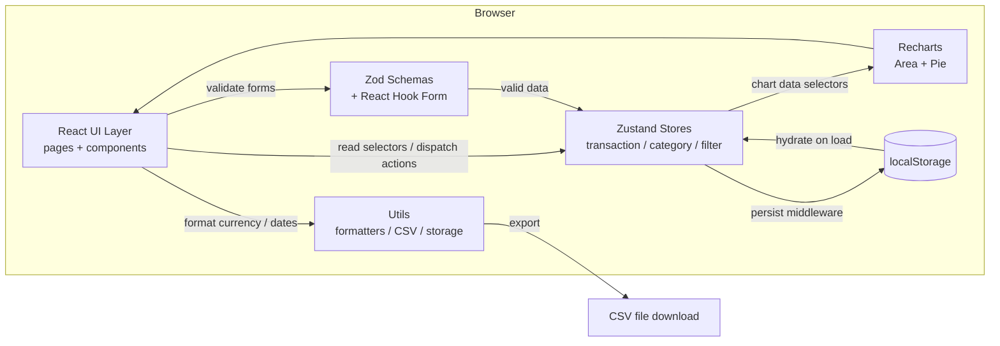

# Expense Tracker — Step-by-Step Build Guide

> **Archived: original build playbook.** This document is the original roadmap used to build the Expense Tracker application. It captures the intended phases, file layout, and implementation decisions in the order they were meant to be executed. The codebase may have evolved since this guide was written, so treat it as a making-of narrative rather than a live specification. For the current setup, architecture, and deployment notes, see [../README.md](../README.md).

---

> **Project Summary:** Expense Tracker is a client-side income and expense management single-page application. Users record transactions (income or expense), classify them with default or custom categories, filter them by type, category, date range, and free-text search, and review their finances through interactive charts (monthly area trend and category pie distribution). All data is persisted locally in the browser via `localStorage`, so the app runs fully offline with no backend or authentication. The UI is fully responsive, supports a dark theme, and is built with accessibility in mind (focus trapping, ARIA roles, keyboard handling). The stack favors modern, type-safe, low-dependency tooling.

Each step below is a self-contained prompt. Execute them in order.

Stack: React 18, TypeScript 5, Vite 5, Tailwind CSS 3, Zustand 4 (with `persist`), React Hook Form 7, Zod 3, Recharts 2, React Router DOM 6, lucide-react, date-fns 3, uuid 9.

---

## Table of Contents

**PHASE 1 — Project Foundation**

- STEP 1 — Project Scaffolding & Dependency Setup
- STEP 2 — Tailwind, Theme Tokens & Global Styles
- STEP 3 — Domain Types

**PHASE 2 — State & Domain Layer**

- STEP 4 — Utilities (Formatters, Storage, CSV Export)
- STEP 5 — Zod Validation Schemas
- STEP 6 — Category Store
- STEP 7 — Transaction Store
- STEP 8 — Filter Store

**PHASE 3 — UI Foundation**

- STEP 9 — Reusable UI Primitives
- STEP 10 — Confirmation Modal (Accessible)
- STEP 11 — Application Layout (Header, Sidebar, Footer)

**PHASE 4 — Feature Modules & Pages**

- STEP 12 — Category Badge
- STEP 13 — Transaction Form, Item & List
- STEP 14 — Filter Bar
- STEP 15 — Charts (Area & Pie)
- STEP 16 — Dashboard & Transactions Pages
- STEP 17 — Routing, Not Found & App Shell

**PHASE 5 — Polish & Deploy**

- STEP 18 — Accessibility, Dark Mode & Responsive Pass
- STEP 19 — Production Build & Deployment

**Appendices**

- Appendix A — Shared Constants & Storage Keys
- Appendix B — Recurring Patterns
- Appendix C — Common Pitfalls
- Appendix D — Pre-flight Checklist

---

## Global Build Rules (apply to EVERY step)

- **No git operations.** Do not run `git init`, `git add`, `git commit`, `git push`, or any other `git` command. Version control is handled manually by the user.
- **Do not install unapproved packages.** Only add the dependencies listed in STEP 1 (or those a later step explicitly requires). Prefer native methods over new dependencies.
- **Do not run long-running processes** (dev servers, watchers) unless the user explicitly asks. A one-shot `npm run build` or `tsc --noEmit` for verification is acceptable.
- **Treat every step as self-contained.** Each step states its goal, the files it touches, and an acceptance result so it can be executed independently.
- **Code quality is mandatory.** Clean, readable, typed code. English identifiers in `camelCase`. ES6+, hooks, and `async/await`. Apply DRY and keep components reusable.
- **Non-functional priorities:** security, accessibility (a11y), and performance come first in every step where they are relevant.

---

## Architecture at a Glance

The application is a fully client-side SPA. There is no server, database, or network layer — persistence is the browser's `localStorage`, wired through Zustand's `persist` middleware.



Key relationships:

- **UI layer** (`src/pages`, `src/components`) is presentational and reads from stores via selector hooks.
- **State layer** (`src/stores`) owns all business logic as actions and selectors (`getSummary`, `getCategoryChartData`, `getMonthlyChartData`, `getFilteredTransactions`).
- **Validation** (`src/schemas`) runs at the form boundary via React Hook Form + `zodResolver`.
- **Persistence** is transparent: `transactionStore` and `categoryStore` use `persist`; `filterStore` is ephemeral (session-only).
- **No third-party services**, no realtime, no file storage beyond a generated CSV blob download.

---

# PHASE 1 — PROJECT FOUNDATION

---

## STEP 1 — Project Scaffolding & Dependency Setup

**Goal:** Create a Vite + React + TypeScript project and install the full dependency set.

**Files/folders to create or edit:**

- `package.json`, `tsconfig.json`, `tsconfig.node.json`, `vite.config.ts`
- `index.html`, `src/main.tsx`, `src/vite-env.d.ts`
- `.gitignore`, `public/wallet.svg`

**Dependencies:**

```bash
npm create vite@latest expense-tracker -- --template react-ts
cd expense-tracker

# Runtime
npm install react-router-dom zustand react-hook-form @hookform/resolvers zod recharts lucide-react uuid date-fns

# Dev / tooling
npm install -D tailwindcss postcss autoprefixer @types/uuid
```

**Implementation notes:**

- Set `"type": "module"` and scripts: `dev` (`vite`), `build` (`tsc && vite build`), `preview` (`vite preview`), and a `lint` script.
- `vite.config.ts` registers `@vitejs/plugin-react` and sets `server.port` and `server.open` for local DX.
- Keep `tsconfig.json` in `strict` mode — type safety is a core project goal.

**Acceptance result:** `npm run dev` boots a blank app at the configured port with no TypeScript errors.

---

## STEP 2 — Tailwind, Theme Tokens & Global Styles

**Goal:** Configure Tailwind with class-based dark mode and the project's semantic color palette.

**Files/folders to create or edit:**

- `tailwind.config.js`, `postcss.config.js`, `src/index.css`

**Implementation notes:**

- `tailwind.config.js`: set `darkMode: 'class'`, `content` globs covering `index.html` and `src/**/*.{js,ts,jsx,tsx}`.
- Extend the theme with two semantic color scales (50–900):
  - `primary` — green scale (income / positive balance, e.g. `500: #22c55e`).
  - `danger` — red scale (expense / negative balance, e.g. `500: #ef4444`).
- `src/index.css`: add the three Tailwind layer imports and any base resets.

**Acceptance result:** Utility classes like `bg-primary-500` and `dark:bg-gray-900` compile and apply.

---

## STEP 3 — Domain Types

**Goal:** Define the central, shared TypeScript contracts for the whole app.

**Files/folders to create or edit:**

- `src/types/index.ts`

**Implementation notes:** Declare and export the core interfaces:

- `Transaction` — `id`, `type: 'income' | 'expense'`, `amount`, `category`, `description`, `date`, `createdAt`.
- `Category` — `id`, `name`, `type`, `color`, `icon`.
- `FilterState` — `dateRange: { start; end } | null`, `type: 'all' | 'income' | 'expense'`, `category: string | null`, `searchQuery`.
- `TransactionFormData`, `TransactionSummary`, `CategoryChartData`, `MonthlyChartData`.

**Acceptance result:** Types import cleanly via `import type { ... } from '../types'` with no circular dependencies.

---

# PHASE 2 — STATE & DOMAIN LAYER

---

## STEP 4 — Utilities (Formatters, Storage, CSV Export)

**Goal:** Build pure, reusable helpers used across stores and components.

**Files/folders to create or edit:**

- `src/utils/formatters.ts`, `src/utils/localStorage.ts`, `src/utils/exportCSV.ts`

**Implementation notes:**

- `formatters.ts`: `formatCurrency` (Intl `en-US` / `USD`), `formatDate` / `formatDateForInput` (date-fns + `enUS` locale, guarded with `isValid`), `getCurrentDate`, `getCurrentISOString`, `formatNumber`, `truncateText`. Localize currency here so it can be swapped in one place.
- `localStorage.ts`: typed `getStorageItem` / `setStorageItem` / `removeStorageItem` wrappers with try/catch, plus a `STORAGE_KEYS` constant map.
- `exportCSV.ts`: `exportTransactionsToCSV` builds a `;`-delimited CSV, prepends a UTF-8 BOM (`\uFEFF`) for Excel Turkish-character support, escapes quotes in descriptions, and triggers a `Blob` download. Guard the empty case defensively (the UI also disables the action when there is no data).

**Acceptance result:** Helpers are pure and unit-testable; `formatCurrency(1234.5)` yields a localized USD string.

---

## STEP 5 — Zod Validation Schemas

**Goal:** Define validation at the form boundary.

**Files/folders to create or edit:**

- `src/schemas/transactionSchema.ts`

**Implementation notes:**

- `transactionSchema`: `type` enum, `amount` positive number with a sane `max`, `category` non-empty string, optional `description` (max length, default `''`), `date` string refined with a real-date check. Use Turkish validation messages to match the UI.
- Also export `categorySchema` (name, type, hex `color` regex, `icon`) for future custom-category UI.
- Export inferred types: `TransactionSchemaType`, `CategorySchemaType`.

**Acceptance result:** `transactionSchema.parse(validData)` succeeds; invalid amount/category/date produce the expected Turkish messages.

---

## STEP 6 — Category Store

**Goal:** Manage categories with persistence and protected defaults.

**Files/folders to create or edit:**

- `src/stores/categoryStore.ts`

**Implementation notes:**

- Seed `DEFAULT_EXPENSE_CATEGORIES` (e.g. Food, Transport, Bills, Entertainment, Health, Shopping, Other) and `DEFAULT_INCOME_CATEGORIES` (Salary, Freelance, Investment, Gift, Other), each with a stable `id`, `color`, and lucide `icon` name.
- Actions: `addCategory`, `updateCategory`, `deleteCategory` (must refuse to delete a default category), `resetCategories`.
- Selectors: `getCategoriesByType`, `getCategoryById`, `getCategoryByName`.
- Wrap with Zustand `persist`, store name `expense-tracker-categories`.

**Acceptance result:** Default categories are present on first load; deleting a default is a no-op.

---

## STEP 7 — Transaction Store

**Goal:** Own transactions plus all derived analytics selectors.

**Files/folders to create or edit:**

- `src/stores/transactionStore.ts`

**Implementation notes:**

- Actions: `addTransaction` (generate `uuid` + `createdAt`, prepend to list), `updateTransaction`, `deleteTransaction`, `clearAllTransactions`.
- Selectors:
  - `getFilteredTransactions(filters)` — filter by type, category, date range (`isWithinInterval` with `startOfDay`/`endOfDay`), and search across description + category.
  - `getSummary(transactions?)` — totals and balance.
  - `getRecentTransactions(limit = 5)` — sorted by date desc.
  - `getCategoryChartData(type, transactions?)` — group by category, resolve names/colors via `categoryStore.getState()`.
  - `getMonthlyChartData(transactions?)` — group by `YYYY-MM`, sort, keep last 6 months.
- Wrap with `persist`, store name `expense-tracker-transactions`.

**Acceptance result:** Adding a transaction updates summary and charts; reload preserves data.

---

## STEP 8 — Filter Store

**Goal:** Hold the active, session-only filter state.

**Files/folders to create or edit:**

- `src/stores/filterStore.ts`

**Implementation notes:**

- State `filters: FilterState` initialized from a `DEFAULT_FILTERS` constant.
- Actions: `setDateRange`, `clearDateRange`, `setType`, `setCategory`, `setSearchQuery`, `resetFilters`.
- Do **not** wrap with `persist` — filters should reset between sessions.

**Acceptance result:** Filter changes re-derive the transaction list immediately; a reload clears filters.

---

# PHASE 3 — UI FOUNDATION

---

## STEP 9 — Reusable UI Primitives

**Goal:** Build the shared component kit and a barrel export.

**Files/folders to create or edit:**

- `src/components/ui/{Button,Input,Select,Card,Modal}.tsx`, `src/components/ui/index.ts`

**Implementation notes:**

- `Button` — `forwardRef`, variants (`primary | secondary | danger | ghost`), sizes, `isLoading` (spinner via `Loader2`), `leftIcon`/`rightIcon`, focus ring styles.
- `Input` / `Select` — labels, error text, optional left/right icons; forward props so React Hook Form `register` works.
- `Card` + `CardHeader` — content container with title/subtitle/action slots.
- `Modal` — backdrop, Escape-to-close, body scroll lock, `role="dialog"` + `aria-modal`, sizes.
- Barrel-export everything from `index.ts`.

**Acceptance result:** Primitives render in isolation and respond to dark mode and keyboard focus.

---

## STEP 10 — Confirmation Modal (Accessible)

**Goal:** Provide an accessible replacement for `window.confirm`.

**Files/folders to create or edit:**

- `src/components/ui/ConfirmModal.tsx` (add to `ui/index.ts`)

**Implementation notes:**

- Variants `danger | warning | info` with matching icon/colors.
- `role="alertdialog"`, labelled title and description, Escape handling, **focus trap** between cancel/confirm, initial focus on cancel, body scroll lock, optional `isLoading` state.

**Acceptance result:** Opening the modal traps focus; Tab cycles only within it; Escape closes it.

---

## STEP 11 — Application Layout (Header, Sidebar, Footer)

**Goal:** Assemble the responsive app shell with theme toggle.

**Files/folders to create or edit:**

- `src/components/layout/{Layout,Header,Sidebar}.tsx`, `src/components/layout/index.ts`

**Implementation notes:**

- `Header` — logo, mobile menu button, and a dark-mode toggle that reads/writes `expense-tracker-theme` and toggles `document.documentElement.classList`. Initialize from stored value or `prefers-color-scheme`.
- `Sidebar` — `NavLink` items (Dashboard, Transactions), mobile slide-in with backdrop, active-state styling, version footer.
- `Layout` — composes Header + Sidebar + `<main>` + a signature footer; manages mobile sidebar open state.

**Acceptance result:** Layout is responsive; theme toggle persists across reloads; sidebar collapses on mobile.

---

# PHASE 4 — FEATURE MODULES & PAGES

---

## STEP 12 — Category Badge

**Goal:** Render a colored, icon-bearing badge for a category id.

**Files/folders to create or edit:**

- `src/components/categories/CategoryBadge.tsx`

**Implementation notes:**

- Map icon-name strings to lucide components via an `iconMap`, falling back to `Tag`.
- Resolve the category from `categoryStore`; if missing, render the raw id gracefully.
- Tint background/text from `category.color` (e.g. `${color}20` background); support `sm`/`md` sizes.

**Acceptance result:** Badges show the correct color, icon, and name for both default and custom categories.

---

## STEP 13 — Transaction Form, Item & List

**Goal:** Full CRUD UI for transactions.

**Files/folders to create or edit:**

- `src/components/transactions/{TransactionForm,TransactionItem,TransactionList}.tsx`, `src/components/transactions/index.ts`

**Implementation notes:**

- `TransactionForm` — `Modal` + React Hook Form + `zodResolver`. Income/expense toggle via `Controller`; amount input parses to number or `undefined`; category options filtered by selected type; resets correctly on open and on edit vs. create.
- `TransactionItem` — icon, category badge, date, description, signed colored amount, edit/delete actions with `aria-label`s.
- `TransactionList` — empty state, maps items, owns the edit form modal, and the delete confirmation via `ConfirmModal` (track `deletingId`; confirm calls `onDelete`). Do not use `window.confirm`.

**Acceptance result:** Create, edit, and delete all work; deleting opens the accessible confirm modal.

---

## STEP 14 — Filter Bar

**Goal:** Drive the filter store from the UI.

**Files/folders to create or edit:**

- `src/components/filters/FilterBar.tsx`, `src/components/filters/index.ts`

**Implementation notes:**

- Search input with clear button, type `Select`, category `Select` (labeled with type), and a date-range pair.
- Show a "Clear Filters" action only when any filter is active (`hasActiveFilters`).
- Accept `show*` props so the bar is reusable in narrower contexts.

**Acceptance result:** Each control updates `filterStore` and the visible list re-derives instantly.

---

## STEP 15 — Charts (Area & Pie)

**Goal:** Visualize trends and category distribution.

**Files/folders to create or edit:**

- `src/components/charts/{ExpenseChart,CategoryPieChart,MonthlyBarChart}.tsx`, `src/components/charts/index.ts`

**Implementation notes:**

- `ExpenseChart` — Recharts `AreaChart` of monthly income vs. expense with gradient fills, localized month labels, currency tick formatter, and a custom dark-mode-aware tooltip. Render an empty state when there is no data.
- `CategoryPieChart` — donut `PieChart` colored per category, custom tooltip with percentage, custom legend.
- `MonthlyBarChart` — optional bar comparison variant.
- Wrap charts in `ResponsiveContainer`.

**Acceptance result:** Charts render real store data, are responsive, and degrade to an empty state cleanly.

---

## STEP 16 — Dashboard & Transactions Pages

**Goal:** Compose features into the two main pages.

**Files/folders to create or edit:**

- `src/pages/Dashboard.tsx`, `src/pages/Transactions.tsx`

**Implementation notes:**

- `Dashboard` — three summary stat cards (balance/income/expense), the area + pie charts, a recent-transactions list with a "View All" link, and a "New Transaction" button opening the form.
- `Transactions` — header with CSV export (disabled when empty) and new-transaction button, the `FilterBar`, a filtered summary row, and the full filtered list.

**Acceptance result:** Both pages render live data and share the `TransactionForm` modal.

---

## STEP 17 — Routing, Not Found & App Shell

**Goal:** Wire routing and a 404 fallback.

**Files/folders to create or edit:**

- `src/pages/NotFound.tsx`, `src/App.tsx`, `src/main.tsx`

**Implementation notes:**

- `main.tsx` — mount `App` inside `BrowserRouter` and `React.StrictMode`; import `index.css`.
- `App.tsx` — wrap `Routes` in `Layout`; routes for `/` (Dashboard), `/transactions` (Transactions), and a catch-all `*` rendering `NotFound`.
- `NotFound` — friendly 404 with Home and Back actions.

**Acceptance result:** Unknown URLs render the 404 page inside the normal layout.

---

# PHASE 5 — POLISH & DEPLOY

---

## STEP 18 — Accessibility, Dark Mode & Responsive Pass

**Goal:** Final quality sweep.

**Files/folders to create or edit:** cross-cutting (no new files expected).

**Implementation notes:**

- Verify `aria-label`s on icon-only buttons, dialog roles, and focus management in both modals.
- Confirm dark-mode classes are present on every surface, text, and border.
- Test layouts at mobile, tablet, and desktop breakpoints.
- Confirm currency/date formatting is consistent (centralized in `formatters.ts`).
- Run `tsc --noEmit` and resolve all type errors.

**Acceptance result:** No type errors; keyboard-only navigation works; UI is consistent in both themes across breakpoints.

---

## STEP 19 — Production Build & Deployment

**Goal:** Produce and verify a deployable build.

**Files/folders to create or edit:** none (build artifacts only).

**Implementation notes:**

- `npm run build` runs `tsc` then `vite build`, emitting `dist/`.
- Ensure `dist` is in `.gitignore`.
- Optionally configure `build.rollupOptions.output.manualChunks` to split vendor/charts and quiet the large-chunk warning.
- Deploy `dist/` to any static host (e.g. Netlify); no environment variables or server are required.

**Acceptance result:** `npm run build` succeeds and `npm run preview` serves a working production bundle.

---

# Appendix A — Shared Constants & Storage Keys

- `STORAGE_KEYS` (in `src/utils/localStorage.ts`):
  - `TRANSACTIONS = 'expense-tracker-transactions'`
  - `CATEGORIES = 'expense-tracker-categories'`
  - `THEME = 'expense-tracker-theme'`
- Zustand `persist` store names must match the transaction/category keys above.
- Theme values: `'dark'` / `'light'`, applied via the `dark` class on `<html>`.
- Color semantics: `primary` = income / positive, `danger` = expense / negative.

---

# Appendix B — Recurring Patterns

- **Selector-driven components:** read state with `useStore((s) => s.value)` selectors to minimize re-renders; never duplicate business logic in components.
- **Derived data lives in stores:** summaries and chart datasets are store selectors, not page-level calculations.
- **Form boundary validation:** every form uses React Hook Form + `zodResolver`; numeric inputs convert `''` to `undefined`.
- **Barrel exports:** each component folder exposes an `index.ts` for clean imports.
- **Localized formatting in one place:** all currency/date formatting goes through `formatters.ts`.
- **Accessible overlays:** modals trap focus, lock body scroll, close on Escape, and expose dialog roles.

---

# Appendix C — Common Pitfalls

- **Cross-store reads:** `transactionStore` resolves category names via `useCategoryStore.getState()` inside selectors — call `getState()` (not the hook) outside React render.
- **Date handling:** always parse with `parseISO` and guard with `isValid`; date-range filtering must normalize with `startOfDay`/`endOfDay`.
- **Persisting filters:** do not wrap `filterStore` with `persist` — stale filters across sessions are confusing.
- **CSV in Excel:** omit the UTF-8 BOM and Turkish characters break in Excel; keep the `\uFEFF` prefix.
- **`window.confirm` regressions:** use `ConfirmModal` for deletions to preserve accessibility.
- **Default category deletion:** keep the guard in `deleteCategory` so seeded categories cannot be removed.
- **Bundle size:** charts (Recharts) dominate the bundle; consider `manualChunks` rather than ignoring the warning.

---

# Appendix D — Pre-flight Checklist

- [ ] `npm install` completes; lockfile committed by the user.
- [ ] `tsc --noEmit` passes with zero errors.
- [ ] Add / edit / delete transaction flows work end to end.
- [ ] Filters (type, category, date range, search) and "clear" behave correctly.
- [ ] Dashboard summary and both charts reflect live data and empty states.
- [ ] CSV export downloads correctly and opens cleanly in Excel.
- [ ] Dark mode toggles and persists across reloads.
- [ ] Keyboard-only navigation works; modals trap focus.
- [ ] 404 route renders for unknown paths.
- [ ] `npm run build` succeeds and `npm run preview` serves the app.
